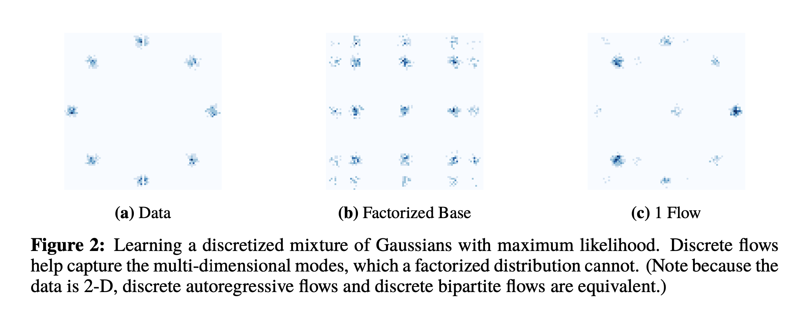
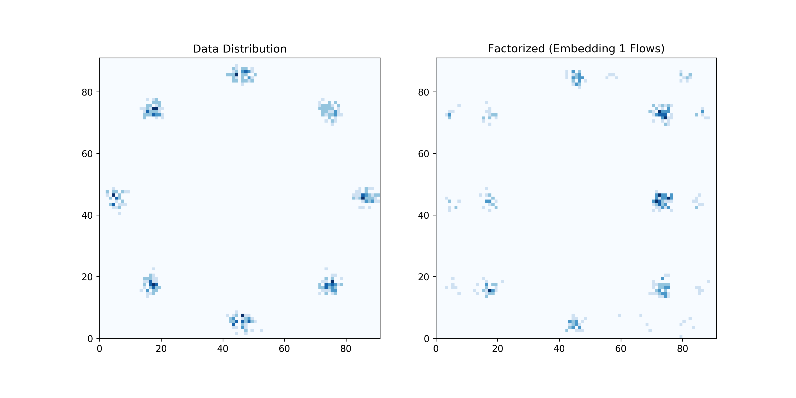
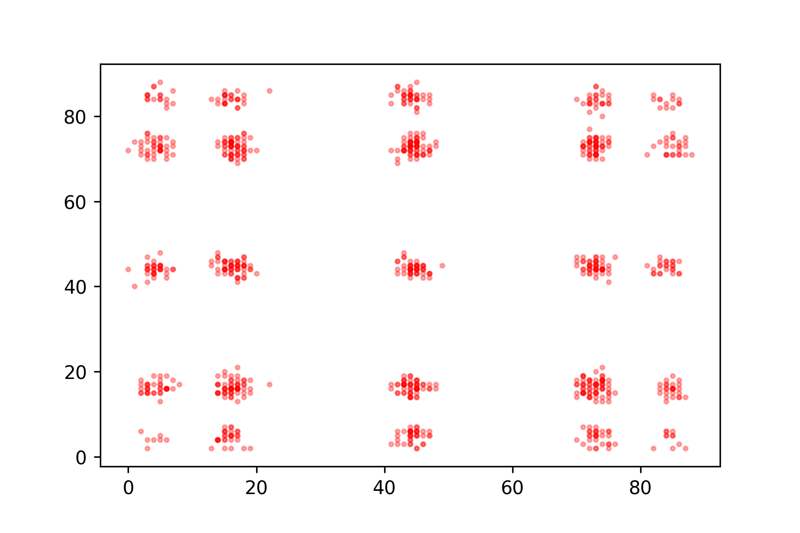

The discrete normalizing flow code is originally taken and modified from: 
https://github.com/google/edward2/blob/master/edward2/tensorflow/layers/discrete_flows.py
and https://github.com/google/edward2/blob/master/edward2/tensorflow/layers/utils.py
Which was introduced in the paper: https://arxiv.org/abs/1905.10347 

The demo file, MADE, and MLP were modified and taken from: https://github.com/karpathy/pytorch-normalizing-flows

To my knowledge as of January 30th 2020, this is the only working demo of discrete normalizing flows in existence. The code in edward2 (implemented in TF2 and Keras did not work for me and also lacked any tutorials). 

Clone the repo, satisfy the below package requirements, then run DiscreteFlowDemo.ipynb. After, you can run Figure2Replication.ipynb where I fail to replicate the figure. 

Requirements: 
Python 3.0+
PyTorch 1.2.0+
Numpy 1.17.2+

Implementation details: 
NB. Going from Andre Karpathy's notation, flow.reverse() goes from the latent space to the data and flow.forward() goes from the data to the latent space. This is the inverse of some other implementations including the original Tensorflow one. 
Implements Bipartite and Autoregressive discrete normalizing flows. Also has an implementation of MADE and a simple MLP. 

TODOs:
* Ensure that the scaling functionality works (this should not matter for being able to reproduce the first few figures.)
* Reproduce the figures from the original paper (I have been unable to do this thus far...)
* Allow MADE autoregressive flow to have a non-natural ordering. 

Failed replication of Figure 2 mixture of gaussians:

Figure 2 in the [paper](https://arxiv.org/abs/1905.10347) looks like this: 

Meanwhile, in my attempted replication (checkout Figure2Replication.ipynb) where I have the same data and factorized distribution, my generated outputs are: 

And sampling from the latent space and doing a backwards pass from z->x through the trained model gives: 

It seems like the latent distribution has too many modes that the model is uncertain how to distribute. So I suppose there needs to be a more reliable way to generate the latent distribution? 